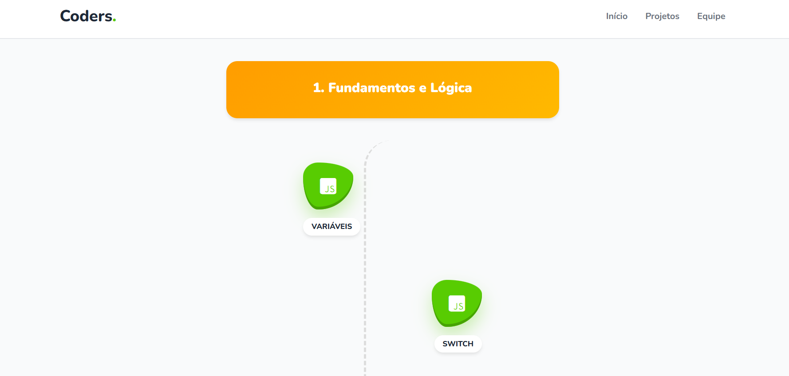

# Edu-Hub

Edu-Hub é uma plataforma online dedicada a fornecer recursos educacionais de alta qualidade para estudantes e educadores. Desenvolvida com tecnologias web modernas, a plataforma oferece uma variedade de materiais e ferramentas para aprimorar o processo de ensino e aprendizagem.



## Índice
 
- [Introdução](#introdução)
- [Instalação](#instalação)
- [Uso](#uso)
- [Funcionalidades](#funcionalidades)
- [Dependências](#dependências)
- [Configuração](#configuração)
- [Documentação](#documentação)
- [Exemplos](#exemplos)
- [Resolução de Problemas](#resolução-de-problemas)
- [Contribuidores](#contribuidores)
- [Licença](#licença)

## Introdução

Edu-Hub é um portal educacional que centraliza diversos recursos e materiais didáticos, facilitando o acesso e a disseminação de conhecimento. A plataforma é projetada para ser intuitiva e acessível, atendendo às necessidades de alunos e professores em diferentes níveis de ensino.

## Instalação

Para configurar o Edu-Hub localmente, siga os passos abaixo:

1. **Clone o repositório:**

   ```bash
   git clone https://github.com/leonardo-ggomes/edu-hub.git
   ```

2. **Navegue até o diretório do projeto:**

   ```bash
   cd edu-hub
   ```

3. **Instale as dependências:**

   Certifique-se de que você possui o [Node.js](https://nodejs.org/) instalado. Em seguida, instale as dependências do projeto:

   ```bash
   npm install
   ```

4. **Inicie o servidor de desenvolvimento:**

   ```bash
   npm start
   ```

5. **Acesse a plataforma:**

   Abra o navegador e navegue até `http://localhost:3000`.

## Uso

Após a instalação, você pode explorar os diversos recursos disponíveis no Edu-Hub, como materiais de estudo, exercícios interativos e ferramentas de gestão educacional. A interface é projetada para ser amigável e de fácil navegação.

## Funcionalidades

- **Biblioteca de Conteúdos:** Acesse uma vasta coleção de materiais didáticos organizados por disciplina e nível de ensino.
- **Exercícios Interativos:** Pratique e teste seus conhecimentos com atividades dinâmicas e feedback imediato.
- **Ferramentas de Gestão:** Professores podem gerenciar turmas, atribuir tarefas e acompanhar o progresso dos alunos.

## Dependências

As principais dependências do projeto incluem:

- **Express:** Framework para servidor web.
- **MongoDB:** Banco de dados NoSQL para armazenamento de dados.
- **React:** Biblioteca para construção de interfaces de usuário.

Para uma lista completa de dependências, consulte o arquivo `package.json`.

## Configuração

As configurações do aplicativo, como parâmetros de conexão e variáveis de ambiente, podem ser ajustadas no arquivo `.env`. Certifique-se de configurar corretamente as credenciais de acesso ao banco de dados e outras configurações essenciais antes de iniciar o aplicativo.

## Documentação

A documentação completa do projeto está disponível no diretório `docs`. Lá você encontrará informações detalhadas sobre a arquitetura do sistema, APIs disponíveis e guias de desenvolvimento.

## Exemplos

Exemplos de uso do Edu-Hub podem ser encontrados no diretório `examples`. Esses exemplos demonstram como integrar e utilizar as principais funcionalidades da plataforma.

## Resolução de Problemas

Caso encontre problemas ao utilizar o Edu-Hub, verifique a seção de [Issues](https://github.com/leonardo-ggomes/edu-hub/issues) no GitHub para possíveis soluções ou para reportar novos problemas.

## Contribuidores

- **Leonardo Gomes:** Desenvolvedor principal. citeturn0search2

## Licença

Este projeto está licenciado sob a Licença MIT. Para mais detalhes, consulte o arquivo `LICENSE` no repositório. 
